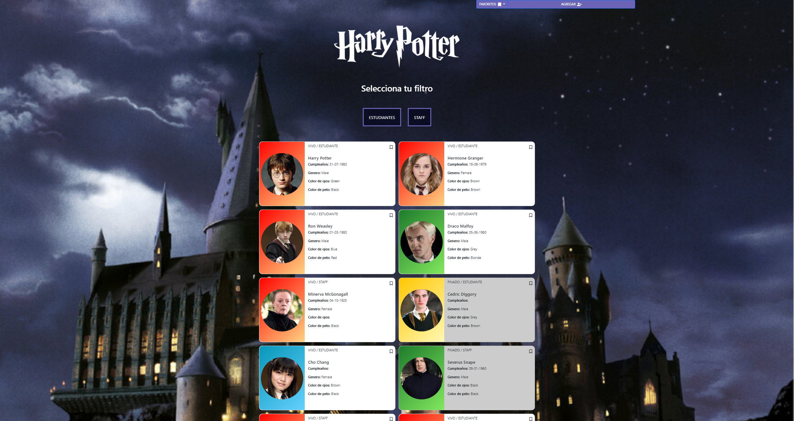

# Prueba Aeroméxico

## Script de instalación
En el directorio de cada proyecto se tiene que ejecutar:
### `npm install`
Instalara las dependencies del archivo package.json
## Scripts disponibles para el frontend
En el directorio del proyecto frontend, puede ejecutar:
### `npm start`
Abra [http://localhost:3000](http://localhost:3000) para verlo en el navegador.

La página se volverá a cargar si realiza modificaciones.  
También verá cualquier error en la consola.

### `npm test`

Inicia el corredor de pruebas en el modo de reloj interactivo.  
Consulte la sección sobre [ejecutar pruebas](https://facebook.github.io/create-react-app/docs/running-tests) para obtener más información.

### `npm run build`

Crea la aplicación para producción en la carpeta "build".  
Agrupa correctamente React en el modo de producción y optimiza la compilación para obtener el mejor rendimiento.

La compilación se minimiza y los nombres de archivo incluyen los hash.  
¡Tu aplicación estará lista para implementarse!

Consulte la sección sobre [implementación](https://facebook.github.io/create-react-app/docs/deployment) para obtener más información.

## Scripts disponibles para el server
En el directorio del proyecto server, puede ejecutar:
### `npm run api`
Abra [http://localhost: 3001/characters](http://localhost: 3001/characters) para verlo en el navegador.
La página se volverá a cargar si realiza modificaciones.  
También verá cualquier error en la consola.

##¿Qué es lo que más te gustó de tu desarrollo?
Me gusto saber que aunque no sabia algunas cosas como Sass y Redux con esta prueba aunque talvez no apruebe, me sirvio de mucho para  
aprender nuevas cosas que es una de las cosas que mas me gustan.

##Si hubieras tenido más tiempo ¿qué hubieras mejorado o qué más hubieras hecho?
pues hubiera logado terminar lo de favoritos y mejorado la parte responsiva para mobile.

##Descríbenos un pain point o bug con el que te hayas encontrado y como lo solucionaste
uno de los bugs que recuerdo era en el json que tube que cambiarlo un poco para que lo leyera que era encerrarlo en llaves  
e identar cada personaje del json.
